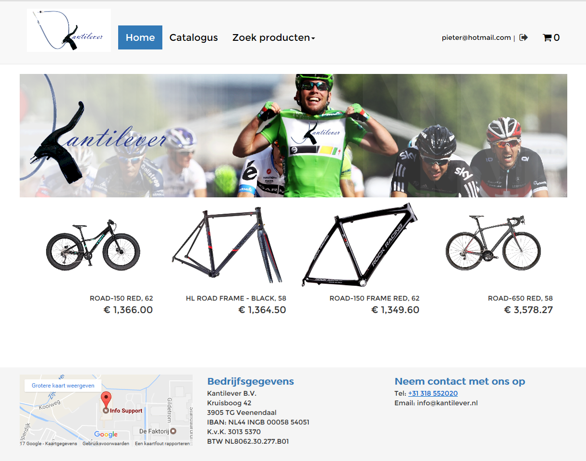

What is it?
-----------
This website is a webshop for the company Kantilever it sells bicycles and bicycle parts.  
To be able to run the website at its full potential you have to start our microservices.  

Technology
------------------
<ul>
  <li>
      AngularJS 1.
  </li>
</ul>

Preview
------------

Map structure
-------------
src  
---app  
------components  
----------authorization  
----------catalog  
----------directives  
----------main  
----------order  
----------resource  
----------shoppingCart  
------css  
------assets  
------test  

Installation
------------
To be able to run the website follow these instruction: 
 
Run these instructions in terminal for linux or cmd for windows. 
 
Install the modules.
 

    npm install && bower install
 
Start the server.
 

    gulp serve 
  

License
---------

MIT License

Copyright (c) 2017 

Permission is hereby granted, free of charge, to any person obtaining a copy
of this software and associated documentation files (the "Software"), to deal
in the Software without restriction, including without limitation the rights
to use, copy, modify, merge, publish, distribute, sublicense, and/or sell
copies of the Software, and to permit persons to whom the Software is
furnished to do so, subject to the following conditions:

The above copyright notice and this permission notice shall be included in all
copies or substantial portions of the Software.

THE SOFTWARE IS PROVIDED "AS IS", WITHOUT WARRANTY OF ANY KIND, EXPRESS OR
IMPLIED, INCLUDING BUT NOT LIMITED TO THE WARRANTIES OF MERCHANTABILITY,
FITNESS FOR A PARTICULAR PURPOSE AND NONINFRINGEMENT. IN NO EVENT SHALL THE
AUTHORS OR COPYRIGHT HOLDERS BE LIABLE FOR ANY CLAIM, DAMAGES OR OTHER
LIABILITY, WHETHER IN AN ACTION OF CONTRACT, TORT OR OTHERWISE, ARISING FROM,
OUT OF OR IN CONNECTION WITH THE SOFTWARE OR THE USE OR OTHER DEALINGS IN THE
SOFTWARE.

Contacts
--------

If you have a concrete bug report for team2 please contact us at 
team2@javaminor.com
